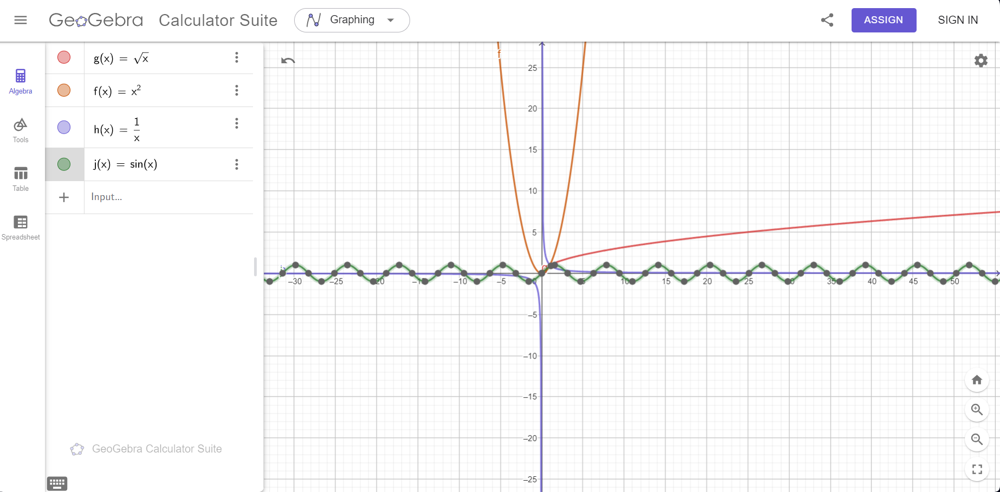

## Solutions:

### 1. Draw in a single GeoGebra notebook the following functions:
The given functions are:
- $f(x) = x^2$
- $g(x) = \sqrt{x}$
- $h(x) = \frac{1}{x}$
- $j(x) = \sin(x)$

#### Find the value of all the above functions at $x = 2$:
- For $f(x)$:

$$
f(2) = 2^2 = 4
$$

- For $g(x)$:

$$
g(2) = \sqrt{2}
$$

- For $h(x)$:

$$
h(2) = \frac{1}{2}
$$

- For $j(x)$:

$$
j(2) = \sin(2)
$$

(Using a calculator, $\sin(2) \approx 0.9093$)

#### Summary:
- $f(2) = 4$
- $g(2) = \sqrt{2} \approx 1.414$
- $h(2) = 0.5$
- $j(2) \approx 0.9093$

### 2. Let $f(x) = 3x - 1$ and $g(x) = \sqrt{x}$. Find:

#### (a) $f(g(x))$:
Substitute $g(x)$ into $f(x)$:

$$
f(g(x)) = f(\sqrt{x}) = 3\sqrt{x} - 1
$$

#### (b) $g(f(x))$:
Substitute $f(x)$ into $g(x)$:

$$
g(f(x)) = g(3x - 1) = \sqrt{3x - 1}
$$

#### (c) $f(f(x))$:
Substitute $f(x)$ into itself:

$$
f(f(x)) = f(3x - 1) = 3(3x - 1) - 1 = 9x - 3 - 1 = 9x - 4
$$

#### (d) $g(g(x))$:
Substitute $g(x)$ into itself:

$$
g(g(x)) = g(\sqrt{x}) = \sqrt{\sqrt{x}} = x^{1/4}
$$

### Final Answers:
- $f(g(x)) = 3\sqrt{x} - 1$
- $g(f(x)) = \sqrt{3x - 1}$
- $f(f(x)) = 9x - 4$
- $g(g(x)) = x^{1/4}$

### 2. Calculate integrals over the interval \([0, \pi]\)

#### Integral of \( f(x) = 2x + 1 \)

$$
\int_{0}^{\pi} (2x + 1) \,dx
$$

Solving:

$$
\int (2x + 1) \,dx = x^2 + x
$$

Evaluating from \( 0 \) to \( \pi \):

$$
(\pi^2 + \pi) - (0^2 + 0) = \pi^2 + \pi
$$

#### Integral of \( g(x) = x^2 \)

$$
\int_{0}^{\pi} x^2 \,dx
$$

Solving:

$$
\int x^2 \,dx = \frac{x^3}{3}
$$

Evaluating from \( 0 \) to \( \pi \):

$$
\frac{\pi^3}{3} - \frac{0^3}{3} = \frac{\pi^3}{3}
$$

---

### 3. Calculate the area of the region bounded by the lines

Bounded region is given by:

$$
x = 1, \quad x = 2, \quad y = 0, \quad y = x^2 + 1
$$

The area is computed as:

$$
\int_{1}^{2} (x^2 + 1) \,dx
$$

Solving:

$$
\int (x^2 + 1) \,dx = \frac{x^3}{3} + x
$$

Evaluating from \( 1 \) to \( 2 \):

$$
\left( \frac{2^3}{3} + 2 \right) - \left( \frac{1^3}{3} + 1 \right)
$$

$$
\left( \frac{8}{3} + 2 \right) - \left( \frac{1}{3} + 1 \right)
$$

$$
\left( \frac{8}{3} + \frac{6}{3} \right) - \left( \frac{1}{3} + \frac{3}{3} \right)
$$

$$
\frac{14}{3} - \frac{4}{3} = \frac{10}{3}
$$

Thus, the area of the region is:

$$
\frac{10}{3}
$$
